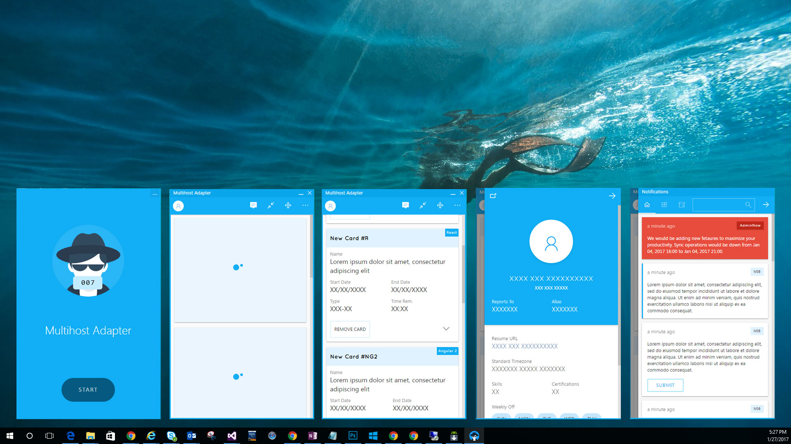
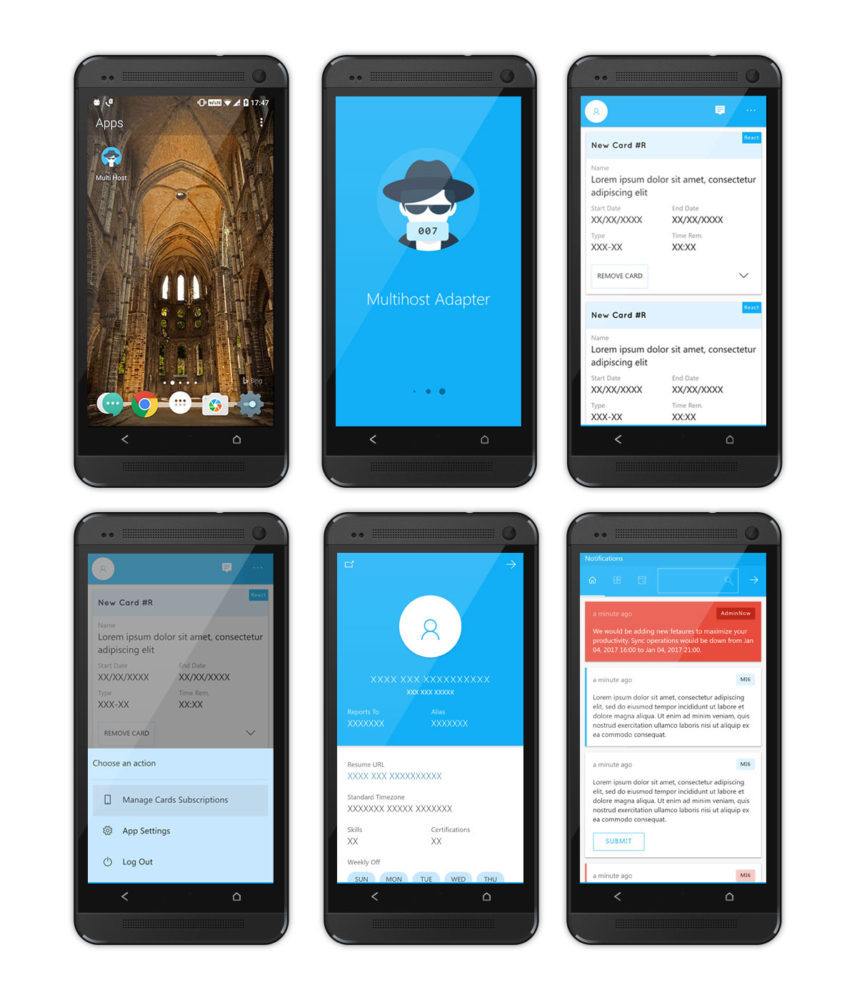
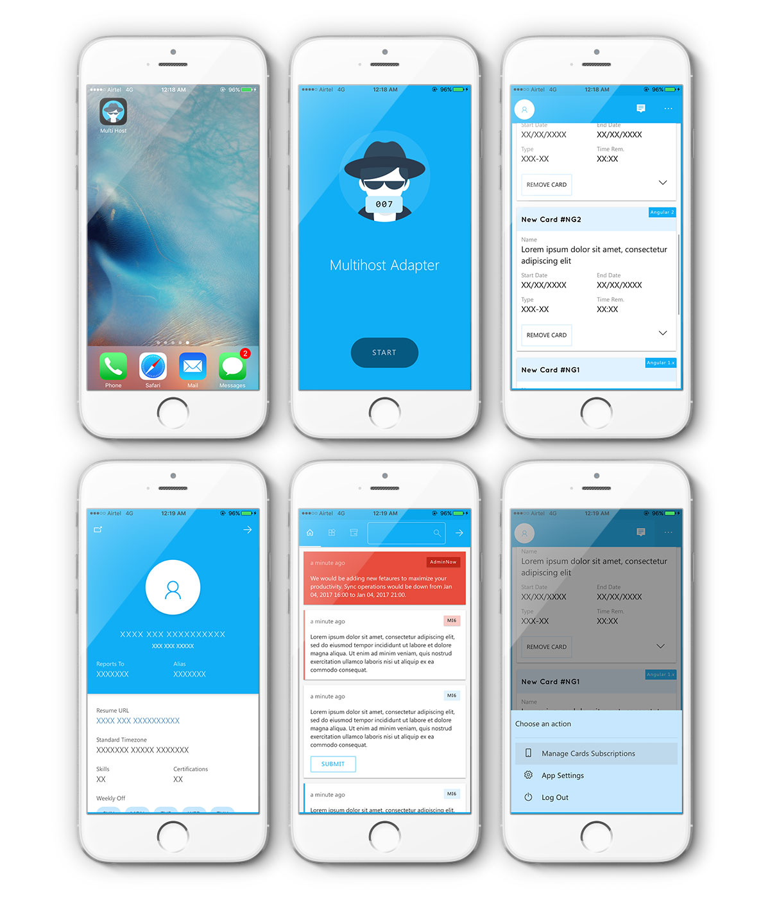

# Multihost.Adapter
An adapter for running ui client apps belonging to different frameworks together

##Currently Supported
#####Angular 1.x
#####Angular 2.x
#####React

## Electron Desktop

 
## Cordova Android Device

 
## Cordova iOS Device

